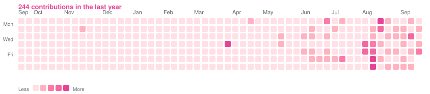

<!-- 顶部波浪横幅 -->
<div align="center">
  
</div>

<!-- 主标题 -->
<div align="center">
  <h1>👋 Hi, I'm Chan Silence</h1>
  <p><b>C++ / Python / AI Enthusiast</b></p>
  
</div>

## 🧑‍💻 About Me

- 🔭 目前在使用 **C++** 与 **Python**，探索 AI 与 ComfyUI 应用
- 🌱 正在学习：数据结构与算法、机器学习、深度学习、机器视觉
- 📍 坐标：中国 · 湖北 · 武汉
- 📫 联系我：[thesilencecf@gmail.com](mailto:thesilencecf@gmail.com)

## 📊 GitHub Stats

<div align="center">
  <a href="https://github.com/Nanako-Arasaka" title="查看我的 GitHub 主页">
    
  </a>
  <a href="https://github.com/Nanako-Arasaka?tab=repositories" title="查看我的全部仓库">
    
  </a>
</div>

## 📅 Contribution Calendar

<!-- contrib-calendar:begin -->
<p><b>261 contributions</b> in the last year</p>

<div align="center">
  
</div>
<!-- contrib-calendar:end -->

<details>
  <summary>如何更新贡献图</summary>

  本图由 `scripts/gen_contrib_svg.py` 根据 GitHub GraphQL 贡献数据生成。

  ```bash
  # 需要已登录 gh CLI
  python3 scripts/gen_contrib_svg.py
  ```

  仓库里还配了 GitHub Actions（`.github/workflows/update-contrib.yml`），每天北京时间 00:00 自动刷新贡献图与贡献数并提交；也可在 Actions 页手动触发。

</details>

## 🚀 Featured Projects

<table>
  <tr>
    <td>
      <a href="https://github.com/Nanako-Arasaka/StressWatch">
        
      </a>
    </td>
    <td>
      <a href="https://github.com/Nanako-Arasaka/dog">
        
      </a>
    </td>
  </tr>
  <tr>
    <td>
      <a href="https://github.com/Nanako-Arasaka/Stable-Academic-Coin">
        
      </a>
    </td>
    <td>
      <a href="https://github.com/Nanako-Arasaka/GO2_Agent">
        
      </a>
    </td>
  </tr>
</table>

<!-- 底部波浪横幅 -->
<div align="center">
  
</div>
